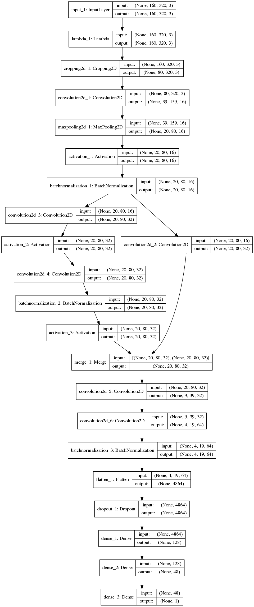
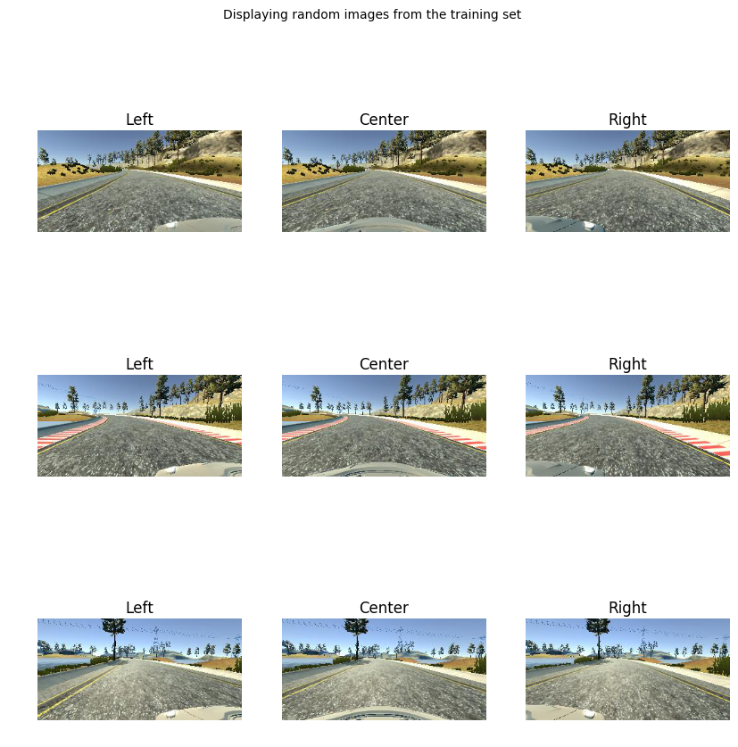
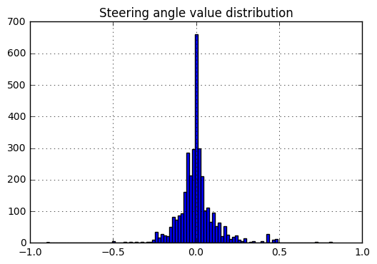
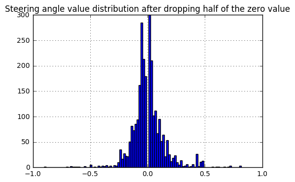
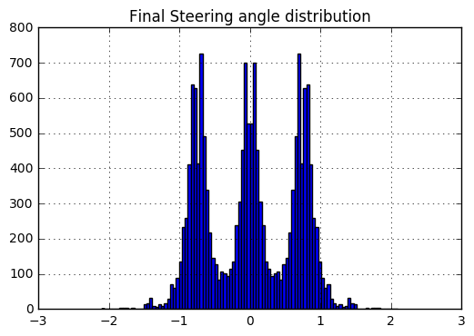

# Project checklist and description

## 1. The repository includes all required files and can be used to run the simulator in autonomous mode

My project includes the following files:
* model.py containing the script to create and train the model
* **drive.py** for driving the car in autonomous mode
* **model_yaml_string.p** (pickle file) containing a trained convolution neural network 
* **my_model_weights.h5** the trained weights for the neural network
* writeup_report.pdf summarizing the results
* Video recording the car driving autonomously around track 1 : https://youtu.be/6LcAAm-0ZGg

## 2. The repository includes functional code
Using the Udacity provided simulator and my drive.py file, the car can be driven autonomously around the track by executing 
```sh
python drive.py model_yaml_string.p my_model_weights.h5
```


## 3. Submission code is usable and readable

The model.py file contains the code for training and saving the convolution neural network. The file shows the pipeline I used for training and validating the model, and it contains comments to explain how the code works.

# Model Architecture and Training Strategy

## 1. An appropriate model architecture has been employed

My model is inspired from the model I used for the Traffic Sign Classification project.
The model structure is very similar to the first layers (stem) of Google's newer Inception neural network. Google's model is called Inception v-4 and the full details are in the following arXiv paper:
https://arxiv.org/abs/1602.07261

My model consists of a convolution neural network with filter sizes and depths between 16 and 64 (model.py lines 260-300).

Google model borrows some ideas from ResNet or SqueezeNet (https://arxiv.org/abs/1602.07360) : a 1x1 convolution neural branch shortcuts a sequence of convolution neural layers before merging again (keras variables 'left_branch' and 'right_branch').

The model uses ELU activations as described in this paper (https://arxiv.org/abs/1511.07289) for faster learning compared to RELU activations.

Also the training image is normalized in the model using a Keras lambda layer and cropped in a cropping layer to remove the sky and the front of the car which are irrelevant for the drive. 

The model is also using Batch Normalization (https://arxiv.org/abs/1502.03167) in order to accelerate training.


## 2. Attempts to reduce overfitting in the model

The model contains one Dropout layer in order to reduce overfitting (model.py lines 294). 

During the model training we made sure that the training loss as well as the validation loss kept decreasing. When the validation loss increases and the training loss starting to increase, it is a sign of overfitting. I did not observe that during training.
A healthy sign was that the validation loss was fairly close to the training loss.

Finally, I left the model driving the car autonomously over an hour and the car stayed continuously on track.

## 3. Model parameter tuning

The model is trained on an adam optimizer with a mean squared error loss, and the learning rate left to default values (model.py line 302).

The model was trained on 20 EPOCHS.

I used a fairly low number of validation examples compared to the training size (10%).
This is because of a smaller number of training images than in the Udacity dataset or in my Traffic Sign Classification dataset.

## 4. Appropriate training data

Training data was chosen to keep the vehicle driving on the road. I used a combination of center camera feed, left and right camera feed. I did not perform any recovery manoeuvers.


# Model Architecture and Training Strategy

## 1. Solution Design Approach

I decided to derive my model from a recent neural network achitecture and choose the Google Inception-v4 model as a source of inspiration because it has been very successful for image classification tasks and more lightweight than older architectures like AlexNet.

As I stated in the previous section, I have never seen any numerical clues that the model was overfitting at any point in time in the design process.

I had 3 majors iterations in the design process until I was able to have the vehicle driving autonomously around the track without leaving the road.

- Dropping from the training set a proportion of images with near-zero steering angle 

- Adding to the training set the side cameras and use a steering correction bias for these side examples (positive for left and negative for right)

- Mirror images to multiply the number of examples

- Making artifically making the steering data more aggressive

I will detail the major iterations in the [3. Creation of the Training Set & Training Process](3. Creation of the Training Set & Training Process) section further down in the report.

## 2. Final Model Architecture
In my final model architecture, I only tweaked the fully connected layer by increasing the number of neural nets in the last layer from 43  to 48 and I dropped the non linear activation in the layer before that.

I have added a detailed visualization of the neural net here:





## 3. Creation of the Training Set & Training Process
The car is driving around a circuit. I recorded the car driving in clockwise and anti-clockwise direction around the track, in order to balance the captured steering angle distribution. Despite this effort my recorded dataset was still quite small. 

Here are some examples recorded from the set.


### Dropping from the training set a proportion of images with near-zero steering angle 
A large proportion of the drive consists in driving almost in straightline. 




If the large majority of the examples presented are examples where the car is driving straight, then the algorithm may only learn to drive straight. 



### Adding to the training set the side cameras and use a steering correction bias for these side examples (positive for left and negative for right)
I treated the left and right cameras as examples of recovery images.
When adding those images to the training dataset an important step was to bias the corresponding center image steering by a value.
I chose a bias of 0.5 degrees (line 163 in model.py).

### Mirror images to multiply the number of examples
Mirroring the captured images and steering angles is a simple data augmentation technique with allows us efficiently balance-out the steering distribution and double the size of the dataset.




### Making artifically making the steering data more aggressive

** Robustness improvement over the drive, a novel idea? **
Having observed that my training dataset is quiet low compared to the dataset provided by Udacity, I was interested in finding a way to improve the robustness of the neural network in a minimal way.

A simple idea is to imagine that the road is a potential field on which the car navigates. This concept is well illustrated on this student video : https://www.youtube.com/watch?v=JT8w94n1kWw

In order to maintain the car in the center of the road we need to make sure that the potential field sharply increases when the vehicle is closer to the sides of the road or its orientation is not towards the center of the road.
With our dataset, the easiest way to artificially increase this field gradient is to increase the steering values in the training dataset by muliplying it by a constant factor (or a gain as called in Control Theory).

By appying a gain to the steering dataset the vehicle steers more steering more agressively when dangerously approaching the edges of the road (model.py line 243).

The cherry on the cake 


# Conclusion

In the future I would like to introduce a neural net to estimate the lateral location of the vehicle on the road and the road curvature. This would be very helpful to design a real control system that performs the actuation of steering as a function of the vehicle's state error

In this fantastic project and I would recommend it to my colleagues! I have learnt how to train a Neural Network to drive a car.
The project was incredibly fun.
After having used a Neural Network for classification, this project uses a Neural net for a regression task.
Both tasks are Supervised Learning tasks and I am hoping to experiment with Unsupervised Learning tasks for training an agent in the future.
